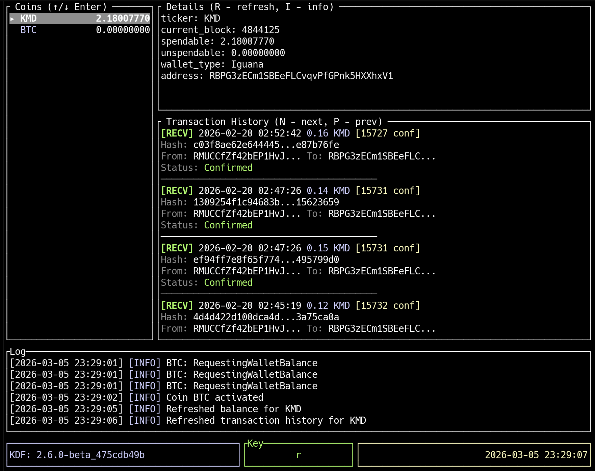

# mm2-rtui

A **TUI (Terminal User Interface)** written in **Rust** for [Komodo DeFi Framework](https://github.com/KomodoPlatform/komodo-defi-framework) (KDF).

It provides a terminal-based interface to interact with the Komodo DeFi Framework core (MM2/kdf) — atomic-swap and P2P trading software for cross-chain assets.

<p align="center">
  
</p>

## Requirements

- [Komodo DeFi Framework](https://github.com/KomodoPlatform/komodo-defi-framework) (kdf) — build and run the `kdf` binary in the same workspace or configure the path accordingly.
- Rust (e.g. via [rustup](https://rustup.rs/)).

## Build & run

```bash
cargo build --release
./target/release/mm2-rtui
```

## Note

Roughly 80% of the code in this repository was generated with the help of AI assistants.

## License

MIT License. Copyright (c) 2025 DeckerSU. See [LICENSE](LICENSE) for details.
